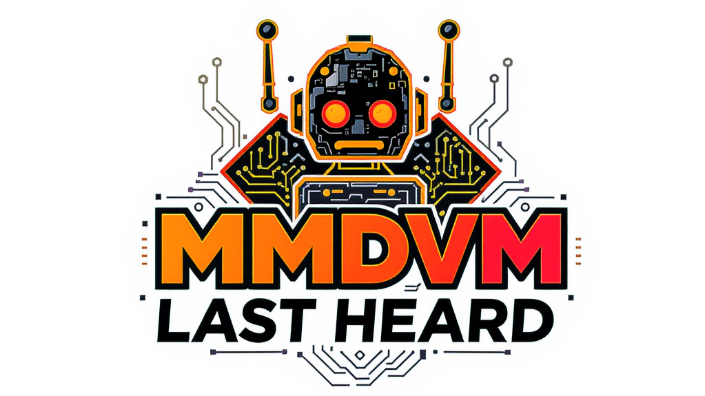

# MMDVM Last Heard Bot

<div style="text-align: center;">




</div>

<table style="margin-left: auto; margin-right: auto;">
  <tr><th colspan="2" style="text-align: center;">Mirrors (daily update)</th></tr>
  <tr><td style="text-align: end;">GitLab</td><td><a href="https://gitlab.com/hafiziruslan/MMDVM-LastHeard">hafiziruslan/MMDVM-LastHeard</a></td></tr>
  <tr><td style="text-align: end;">Codeberg</td><td><a href="https://codeberg.org/hafiziruslan/MMDVM-LastHeard">hafiziruslan/MMDVM-LastHeard</a></td></tr>
  <tr><td style="text-align: end;">Gitea</td><td><a href="https://gitea.com/HafiziRuslan/MMDVM-LastHeard">HafiziRuslan/MMDVM-LastHeard</a></td></tr>
</table>

## About

**MMDVM Last Heard Bot** is a Python-based utility designed for amateur radio operators to monitor their digital voice activity remotely. The bot tracks MMDVMHost log files in real-time, parses transmission data from various digital modes (DMR, D-STAR, YSF), and sends formatted "Last Heard" notifications to a specified Telegram chat. This allows hotspot and repeater owners to stay updated on local activity without needing to access the physical dashboard.

## Features

### Current Features

- **Real-time Monitoring**: Automatically tracks MMDVMHost log files for new activity.
- **Multi-Mode Support**: Parses and formats transmission data for:
  - **Digital Voice**: DMR, D-STAR, and YSF (C4FM).
  - **Digital Data**: YSF (C4FM).
- **Telegram Integration**: Sends instant notifications to a specific Telegram chat or group.
- **Easy Configuration**: Managed via simple environment variables in a `.env` file.
- **Automated Maintenance**: The `main.sh` script handles system dependencies, repository updates, and virtual environment management.
- **Lightweight**: Uses `uv` for fast and efficient Python environment handling.

### Upcoming Features

- **Extended Mode Support**: Adding compatibility for NXDN and P25 (Voice & Data).
- **Expanded Data Logging**: Support for DMR, D-STAR, NXDN, and P25 digital data.
- **Multi-Platform Notifications**: Support for Discord webhooks and Matrix bots.
- **Filtering Options**: Filter notifications by specific TalkGroups or Callsigns.

## Prerequisites

- **Linux OS**: A system running Pi-Star, WPSD, or a standard Debian-based distribution.
- **Python 3.11+**: While the script manages environments, a base Python installation is required.
- **Telegram Bot**:
  - A Bot Token from [@BotFather](https://t.me/botfather).
  - Your Telegram Chat ID (or Group ID).
- **Log Access**: Read permissions for MMDVMHost log files (usually in `/var/log/pi-star/` or `/var/log/mmdvm/`).

### Dependencies

The following system packages are required for the bot and its environment manager to function correctly:

- `curl`: Required for downloading `uv` and other setup components.
- `git`: Required for repository management and automatic updates.
- `gcc` & `python3-dev`: Required for compiling certain Python dependencies.
- `uv`: Fast Python package and environment manager.
- `lsb-release`: Required for identifying the distribution during setup.

The `main.sh` script will attempt to install these automatically if they are missing.

Note: to install `uv` using `apt`, you may use the `debian.griffo.io` repository:

```bash
curl -sS https://debian.griffo.io/EA0F721D231FDD3A0A17B9AC7808B4DD62C41256.asc | sudo gpg --dearmor --yes -o /etc/apt/trusted.gpg.d/debian.griffo.io.gpg
echo "deb https://debian.griffo.io/apt $(lsb_release -sc 2>/dev/null) main" | sudo tee /etc/apt/sources.list.d/debian.griffo.io.list
sudo apt update && sudo apt install uv
```

## 🛠️ Installation & Configuration

1. **Clone the repository**:

   ```bash
   git clone https://github.com/HafiziRuslan/MMDVM-LastHeard.git
   cd MMDVM-LastHeard
   ```

2. **Setup environment variables**:
   Copy the template and fill in your Telegram Bot token, Chat ID, and log paths.

   ```bash
   cp .env.sample .env
   nano .env
   ```

## 🚀 Usage

Run the main script with root privileges. This script automatically manages system dependencies, installs `uv`, sets up the virtual environment, and handles updates.

```bash
sudo chmod +x main.sh
sudo ./main.sh
```

## ⏰ AutoStart

To run the bot automatically on system boot, add the following entry to your `/etc/crontab` (change `pi-star` to your actual username and verify the path):

```bash
@reboot pi-star cd /home/pi-star/MMDVM-LastHeard && ./main.sh > /dev/null 2>&1
```

## 🔄 Update

Manual updates are **not required**. The `main.sh` script checks for and applies updates from the repository automatically upon execution.

### Source

[iu2frl/pistar-lastheard-telegram](https://github.com/iu2frl/pistar-lastheard-telegram)
